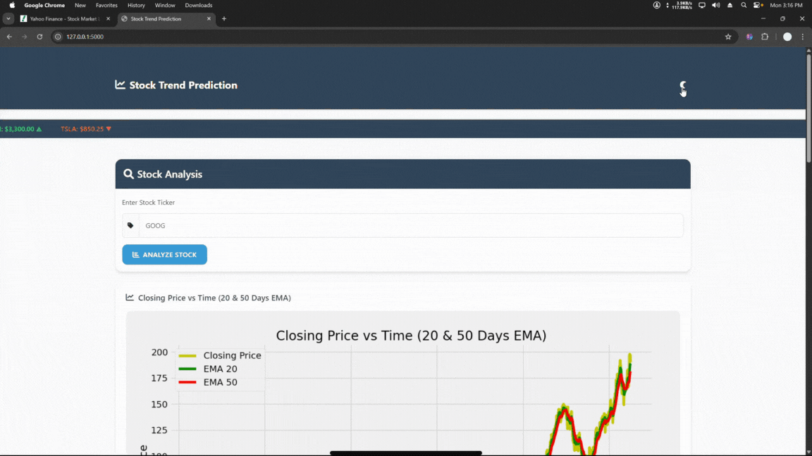

# Stock Price Prediction – Predict the Future, Today.

Welcome to a project built with curiosity, passion, and a love for learning.  
This is not just code — it’s a step toward understanding how data and AI can help us see patterns in the stock market.

The model predicts stock prices and shows them compared to actual values on a graph.


## What This Project Is About

This project uses **machine learning** (LSTM model) to predict stock prices based on historical data.

It takes real stock data, processes it, trains a deep learning model, and then makes predictions.  
If you’re new to ML or just curious about the stock market, this is a great place to start.

---

## What You’ll Learn

- How to collect stock data using Yahoo Finance
- How to clean and prepare time-series data
- How LSTM (a type of neural network) works for prediction
- How to visualize stock price predictions vs real prices

---

## Tools & Libraries Used

- Python  
- Pandas & NumPy  
- Matplotlib  
- Scikit-learn  
- TensorFlow / Keras  
- yfinance (Yahoo Finance API)

---

## How to Run It

1. Clone the repo:
   ```bash
   git clone https://github.com/ankitsharma-tech/Stock-Price-Prediction.git
   cd Stock-Price-Prediction
   ```

2. Install the required libraries:

   ```bash
   pip install -r requirements.txt
   ```

3. Run the project:

   ```bash
   python main.py
   ```
---

### Want to Contribute?

Feel free to fork this repo, play with the code, and improve it.
Pull requests and suggestions are always welcome!